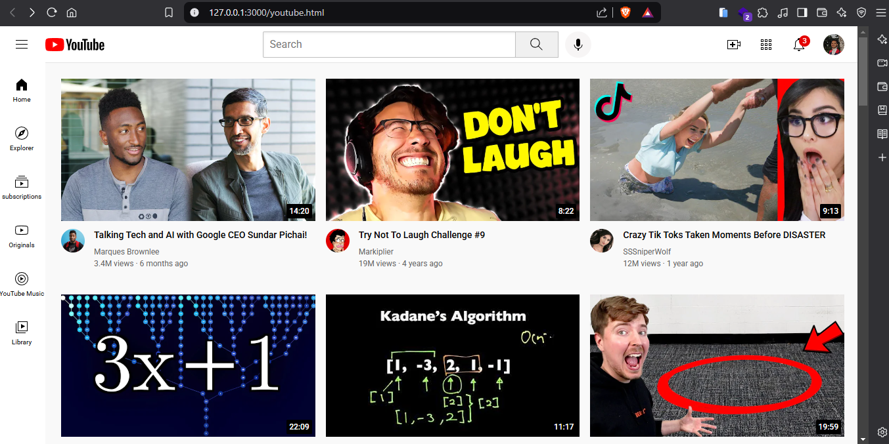

# 🎓 HTML & CSS Course - SuperSimpleDev

## 📌 Course Overview  
This repository contains my notes, exercises, and projects from the **SuperSimpleDev HTML & CSS course**. The course helped me gain a solid foundation in **HTML & CSS**, covering essential concepts and best practices for modern web development.

## 📖 What I Learned  
- ✅ HTML structure, elements, and semantics  
- ✅ CSS basics (selectors, properties, box model)  
- ✅ Flexbox & Grid layout techniques  
- ✅ Responsive design principles  
- ✅ Forms, tables, and media elements  
- ✅ CSS animations & transitions  
- ✅ Best practices for writing clean and maintainable code  

## 🛠 Projects Completed  
- **Basic Webpage Layout** – A simple website using HTML & CSS  
- **Responsive Design Project** – A mobile-friendly website  
- **Mini Projects** – Buttons, cards, and navigation bars  

## 📂 How to Use This Repository  
1. Clone the repository:  
   ```sh
   git clone https://github.com/rautsachin/HTML-CSS-Supersimpledev.git

## Project Screenshot


